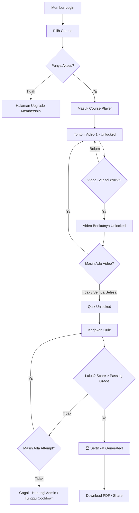
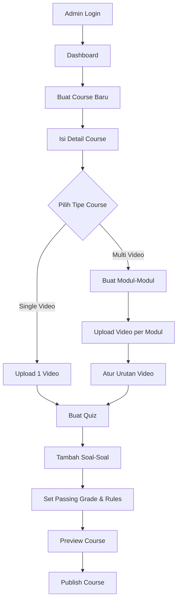

## Platform Membership & Digital Assets

> Platform membership untuk akses ke berbagai aset digital premium: 100+ Ebooks, 100+ Video Courses, dan 100+ Voice SFX.

---

## 1. Gambaran Umum

**Bankable** adalah platform web edukasi yang memungkinkan admin membuat dan mengelola course berbasis video dengan sistem membership. Member yang terdaftar dapat mengakses course, menonton video secara berurutan, mengerjakan tes, dan mendapatkan sertifikat digital jika lulus.

---

## 2. Tech Stack

| Layer | Teknologi |
|-------|-----------|
| **Frontend** | Next.js (React) + Vanilla CSS |
| **Backend** | Next.js API Routes |
| **Database** | PostgreSQL via Prisma ORM |
| **Auth** | NextAuth.js (credential + Google OAuth) |
| **Asset Delivery**| Local storage / S3-compatible (MinIO) / Cloudflare R2 |
| **Video Hosting** | Upload lokal / integrasi YouTube / Vimeo embed |
| **Payment** | Midtrans / Xendit (integrasi payment gateway Indonesia) |
| **Deployment** | Vercel / VPS (Docker) |

> [!NOTE]
> Tech stack bisa disesuaikan. Jika preferensi berbeda (misal: WordPress, Laravel, dll), bisa didiskusikan.

---

## 3. User Roles

| Role | Deskripsi |
|------|-----------|
| **Super Admin** | Kelola seluruh platform, user management, settings |
| **Admin** | Buat & kelola course, upload video, buat quiz, lihat laporan |
| **Member** | Akses course, tonton video, kerjakan quiz, download sertifikat |
| **Guest** | Hanya bisa lihat landing page & daftar course (preview) |

---

## 4. Fitur Utama

### 4.1 🔐 Authentication & Membership

- Registrasi & login (email/password + Google OAuth)
- Sistem membership bertingkat:

| Tier | Akses | Harga |
|------|-------|-------|
| **Free** | 1-2 course gratis, preview video | Rp 0 |
| **Basic** | Akses sebagian course | Rp 99.000/bln |
| **Premium** | Akses semua course + sertifikat | Rp 199.000/bln |
| **Lifetime** | Akses seumur hidup | Rp 1.499.000 (one-time) |

- Manajemen profil member
- Riwayat pembayaran & subscription

---

### 4.2 📚 Course Management (Admin)

Admin dapat membuat course dengan **dua opsi format video**:

#### Opsi A: Single Video (Video Full)
```
📁 Course: "Dasar Investasi Saham"
└── 🎬 1 Video Full (durasi panjang, misal 2 jam)
└── 📝 Quiz Akhir
└── 🏆 Sertifikat
```
- Satu video utuh per course
- Cocok untuk webinar recording, workshop, atau materi singkat
- Member cukup menonton 1 video sampai selesai → lanjut quiz

#### Opsi B: Multi Video (Video Berseri)
```
📁 Course: "Financial Planning Masterclass"
├── 📂 Modul 1: Pengenalan
│   ├── 🎬 Video 1.1 - Apa itu Financial Planning (15 min)
│   ├── 🎬 Video 1.2 - Mengapa Penting (10 min)
├── 📂 Modul 2: Budgeting
│   ├── 🎬 Video 2.1 - Cara Membuat Budget (20 min)
│   ├── 🎬 Video 2.2 - Tools Budgeting (15 min)
│   ├── 🎬 Video 2.3 - Studi Kasus (25 min)
├── 📂 Modul 3: Investasi
│   ├── 🎬 Video 3.1 - Jenis Investasi (20 min)
│   └── 🎬 Video 3.2 - Strategi Pemula (30 min)
└── 📝 Quiz Akhir
└── 🏆 Sertifikat
```
- Beberapa video yang dikelompokkan dalam modul
- Video harus ditonton **secara berurutan** (sequential / locked progression)
- Video berikutnya baru terbuka setelah video sebelumnya **selesai ditonton**
- Progress bar per modul dan keseluruhan course

#### Detail Fitur Course Admin:
- CRUD Course (judul, deskripsi, thumbnail, kategori, level, harga)
- Pilih tipe course: **Single Video** atau **Multi Video**
- Upload video (drag & drop) atau embed URL (YouTube/Vimeo)
- Atur urutan video & modul (drag & drop reorder)
- Set minimum watch percentage (misal: 90% video harus ditonton)
- Preview course sebelum publish
- Status course: Draft / Published / Archived
- Duplikasi course

---

### 4.3 🎬 Video Player & Progress Tracking (Member)

```
┌─────────────────────────────────────────────┐
│  🎬 Video Player                            │
│  ┌───────────────────────────────────────┐  │
│  │                                       │  │
│  │          [VIDEO PLAYER]               │  │
│  │                                       │  │
│  └───────────────────────────────────────┘  │
│  ▶ ━━━━━━━━━━━━━━━━━━━━━━━━━━━━━━ 75%     │
│                                             │
│  📋 Daftar Video          Progress: 3/7     │
│  ├── ✅ Video 1.1 (selesai)                │
│  ├── ✅ Video 1.2 (selesai)                │
│  ├── ✅ Video 2.1 (selesai)                │
│  ├── ▶️ Video 2.2 (sedang ditonton)        │
│  ├── 🔒 Video 2.3 (terkunci)              │
│  ├── 🔒 Video 3.1 (terkunci)              │
│  └── 🔒 Video 3.2 (terkunci)              │
│                                             │
│  [📝 Quiz Akhir - 🔒 Selesaikan semua video] │
└─────────────────────────────────────────────┘
```

**Sistem Progression:**
- Video pertama selalu **unlocked**
- Video berikutnya **locked** sampai video sebelumnya selesai
- "Selesai" = member menonton minimal **90%** durasi video (configurable)
- Anti-skip: tracking posisi playback, tidak bisa fast-forward melewati bagian yang belum ditonton (opsional, configurable)
- Resume: jika member keluar, bisa lanjut dari posisi terakhir
- Progress disimpan otomatis setiap 10 detik

**Fitur Video Player:**
- Custom video player dengan kontrol standar (play, pause, volume, fullscreen)
- Playback speed (0.5x, 1x, 1.25x, 1.5x, 2x)
- Catatan/Notes per video (member bisa tulis catatan sambil nonton)
- Bookmark timestamp tertentu
- Subtitle/CC support (opsional)

---

### 4.4 📝 Quiz / Tes Akhir

Quiz hanya bisa diakses setelah **semua video dalam course selesai ditonton**.

#### Tipe Soal yang Didukung:
| Tipe | Deskripsi |
|------|-----------|
| **Pilihan Ganda** | 4 opsi, 1 jawaban benar |
| **Pilihan Ganda (Multi)** | 4+ opsi, beberapa jawaban benar |
| **True / False** | Benar atau Salah |
| **Essay Singkat** | Jawaban teks pendek (auto/manual grading) |

#### Pengaturan Quiz (Admin):
- Jumlah soal (misal: 20 soal)
- Passing grade / Nilai minimum lulus (misal: 70%)
- Durasi waktu pengerjaan (misal: 30 menit)
- Acak urutan soal (shuffle)
- Acak urutan opsi jawaban
- Maksimal percobaan (misal: 3x attempt)
- Tampilkan jawaban benar setelah submit (on/off)
- Cooldown antar percobaan (misal: 24 jam)

#### Pengalaman Member:
```
┌─────────────────────────────────────────┐
│  📝 Quiz: Financial Planning Masterclass│
│                                         │
│  Soal 5 dari 20        ⏱️ 25:30 tersisa│
│  ━━━━━━━━━━━━━━━━━━━━━━━━━━ 25%       │
│                                         │
│  Apa langkah pertama dalam membuat      │
│  rencana keuangan?                      │
│                                         │
│  ○ A. Langsung investasi               │
│  ● B. Evaluasi kondisi keuangan saat ini│
│  ○ C. Pinjam uang                      │
│  ○ D. Beli asuransi                    │
│                                         │
│  [← Sebelumnya]            [Berikutnya →]│
└─────────────────────────────────────────┘
```

- Timer countdown
- Navigasi soal (bisa pindah-pindah soal)
- Tandai soal untuk review
- Konfirmasi sebelum submit
- Hasil langsung ditampilkan setelah submit
- Detail jawaban benar vs salah (jika diaktifkan admin)

---

### 4.5 🏆 Sertifikat Digital

Sertifikat otomatis di-generate jika member **lulus quiz** (mencapai passing grade).

#### Desain Sertifikat:
```
╔═══════════════════════════════════════════════════╗
║                                                   ║
║              🏛️  B A N K A B L E                  ║
║           Certificate of Completion               ║
║                                                   ║
║  This certifies that                              ║
║                                                   ║
║          ✨ [NAMA MEMBER] ✨                      ║
║                                                   ║
║  has successfully completed the course             ║
║                                                   ║
║    "Financial Planning Masterclass"               ║
║                                                   ║
║  Score: 85/100  |  Date: 14 April 2026            ║
║                                                   ║
║  Certificate ID: BNK-2026-FPM-00142              ║
║                                                   ║
║  [QR Code]           [Tanda Tangan Digital]       ║
║                                                   ║
╚═══════════════════════════════════════════════════╝
```

**Fitur Sertifikat:**
- Auto-generate PDF setelah lulus quiz
- Unique Certificate ID untuk verifikasi
- QR Code yang mengarah ke halaman verifikasi publik
- Template sertifikat customizable oleh admin
- Download sebagai PDF
- Share ke LinkedIn / media sosial
- Halaman verifikasi publik (`bankable.com/verify/BNK-2026-FPM-00142`)

---

### 4.6 📊 Dashboard & Analytics

#### Admin Dashboard:
- Total member (aktif, baru, churn)
- Revenue & subscription metrics
- Course analytics (enrollment, completion rate, average score)
- Video engagement (watch time, drop-off points)
- Quiz performance (pass rate, average score, soal tersulit)
- Top performing courses
- Export laporan ke CSV/Excel

#### Member Dashboard:
- Course yang sedang diikuti & progress
- Course yang sudah selesai
- Sertifikat yang sudah didapat
- Riwayat quiz & nilai
- Rekomendasi course selanjutnya

---

### 4.7 💡 Fitur Tambahan yang Disarankan

> [!TIP]
> Fitur-fitur ini bisa ditambahkan untuk meningkatkan engagement dan value platform.

| Fitur | Deskripsi | Prioritas |
|-------|-----------|-----------|
| **Discussion Forum** | Forum diskusi per course, member bisa tanya & jawab | ⭐⭐⭐ |
| **Gamification** | Badge, points, leaderboard untuk motivasi belajar | ⭐⭐ |
| **Email Notifications** | Reminder lanjut belajar, notif course baru, hasil quiz | ⭐⭐⭐ |
| **Mobile Responsive** | Tampilan optimal di HP & tablet | ⭐⭐⭐ |
| **Offline Mode (PWA)** | Download video untuk ditonton offline | ⭐⭐ |
| **Live Session** | Jadwal live webinar/Q&A dengan instruktur | ⭐⭐ |
| **Referral System** | Member invite teman, dapat diskon/reward | ⭐⭐ |
| **Rating & Review** | Member bisa rating & review course | ⭐⭐⭐ |
| **Wishlist** | Simpan course yang ingin diambil nanti | ⭐ |
| **Learning Path** | Kumpulan course yang direkomendasikan secara berurutan | ⭐⭐ |
| **Instructor Profile** | Profil instruktur/pembicara dengan bio & expertise | ⭐⭐ |
| **Content Drip** | Rilis konten secara terjadwal (misal: 1 modul/minggu) | ⭐⭐ |
| **Multi-language** | Support Bahasa Indonesia & English | ⭐ |
| **Dark Mode** | Toggle dark/light theme | ⭐⭐ |
| **Bulk Enrollment** | Daftarkan banyak member ke course sekaligus (B2B/corporate) | ⭐⭐ |

---

## 5. Database Schema (High-Level)

```
┌──────────────┐     ┌───────────────┐     ┌──────────────┐
│    Users      │────▶│  Memberships  │     │   Courses    │
│──────────────│     │───────────────│     │──────────────│
│ id           │     │ id            │     │ id           │
│ name         │     │ user_id       │     │ title        │
│ email        │     │ tier          │     │ description  │
│ password     │     │ start_date    │     │ type (single/│
│ role         │     │ end_date      │     │   multi)     │
│ avatar       │     │ status        │     │ thumbnail    │
│ created_at   │     │ payment_id    │     │ category     │
└──────────────┘     └───────────────┘     │ level        │
       │                                    │ price        │
       │                                    │ status       │
       │                                    │ created_by   │
       │                                    └──────┬───────┘
       │                                           │
       │              ┌───────────────┐            │
       │              │    Modules    │◀───────────┘
       │              │───────────────│
       │              │ id            │
       │              │ course_id     │
       │              │ title         │
       │              │ order         │
       │              └──────┬────────┘
       │                     │
       │              ┌──────┴────────┐
       │              │    Videos     │
       │              │───────────────│
       │              │ id            │
       │              │ module_id     │
       │              │ title         │
       │              │ url / file    │
       │              │ duration      │
       │              │ order         │
       │              └───────────────┘
       │
       │         ┌────────────────────┐     ┌───────────────┐
       ├────────▶│  Video Progress    │     │    Quizzes    │
       │         │────────────────────│     │───────────────│
       │         │ id                 │     │ id            │
       │         │ user_id            │     │ course_id     │
       │         │ video_id           │     │ title         │
       │         │ watched_percentage │     │ passing_grade │
       │         │ last_position      │     │ time_limit    │
       │         │ is_completed       │     │ max_attempts  │
       │         │ updated_at         │     │ shuffle       │
       │         └────────────────────┘     └──────┬────────┘
       │                                           │
       │         ┌────────────────────┐     ┌──────┴────────┐
       ├────────▶│  Quiz Attempts     │     │   Questions   │
       │         │────────────────────│     │───────────────│
       │         │ id                 │     │ id            │
       │         │ user_id            │     │ quiz_id       │
       │         │ quiz_id            │     │ type          │
       │         │ score              │     │ question_text │
       │         │ passed             │     │ options (JSON)│
       │         │ started_at         │     │ correct_answer│
       │         │ completed_at       │     │ points        │
       │         └────────────────────┘     └───────────────┘
       │
       │         ┌────────────────────┐
       └────────▶│  Certificates      │
                 │────────────────────│
                 │ id                 │
                 │ user_id            │
                 │ course_id          │
                 │ quiz_attempt_id    │
                 │ certificate_number │
                 │ score              │
                 │ issued_at          │
                 │ pdf_url            │
                 │ qr_code            │
                 └────────────────────┘
```

---

## 6. Halaman / Routes

### 🌐 Public Pages
| Route | Halaman |
|-------|---------|
| `/` | Landing Page |
| `/courses` | Katalog Course |
| `/courses/[slug]` | Detail Course (preview) |
| `/pricing` | Paket Membership |
| `/login` | Login |
| `/register` | Register |
| `/verify/[cert-id]` | Verifikasi Sertifikat Publik |

### 👤 Member Area (Protected)
| Route | Halaman |
|-------|---------|
| `/dashboard` | Dashboard Member |
| `/my-courses` | Course Saya |
| `/my-courses/[slug]` | Course Player (video + sidebar progress) |
| `/my-courses/[slug]/quiz` | Quiz / Tes Akhir |
| `/my-courses/[slug]/quiz/result` | Hasil Quiz |
| `/certificates` | Daftar Sertifikat Saya |
| `/profile` | Edit Profil |
| `/billing` | Tagihan & Riwayat Pembayaran |

### 🛠️ Admin Panel
| Route | Halaman |
|-------|---------|
| `/admin` | Dashboard Admin (analytics) |
| `/admin/courses` | Kelola Course |
| `/admin/courses/new` | Buat Course Baru |
| `/admin/courses/[id]/edit` | Edit Course (video, modul, quiz) |
| `/admin/courses/[id]/quiz` | Kelola Quiz & Soal |
| `/admin/members` | Kelola Member |
| `/admin/certificates` | Kelola Template Sertifikat |
| `/admin/payments` | Laporan Pembayaran |
| `/admin/settings` | Pengaturan Platform |

---

## 7. Flow Utama

### 7.1 Flow Member Belajar


### 7.2 Flow Admin Buat Course


---

## 8. Fase Pengembangan

### Phase 1 — MVP (4-6 minggu)
- [x] Setup project (Next.js, Prisma, PostgreSQL)
- [ ] Auth system (login, register, roles)
- [ ] Landing page & course catalog
- [ ] Course CRUD (admin) — single & multi video
- [ ] Video player dengan progress tracking & sequential lock
- [ ] Quiz system (pilihan ganda)
- [ ] Sertifikat PDF generation
- [ ] Member dashboard

### Phase 2 — Enhancement (3-4 minggu)
- [ ] Payment gateway integration (Midtrans/Xendit)
- [ ] Membership tier system
- [ ] Admin analytics dashboard
- [ ] Email notifications
- [ ] Discussion forum per course
- [ ] Rating & review
- [ ] Mobile responsive polish

### Phase 3 — Scale (2-3 minggu)
- [ ] Gamification (badge, points)
- [ ] Learning paths
- [ ] Content drip
- [ ] Referral system
- [ ] SEO optimization
- [ ] Performance optimization & caching
- [ ] PWA support

---

## 9. Verification Plan

### Automated Tests
- **Unit tests**: Prisma models, quiz scoring logic, certificate number generation
- **API tests**: Auth endpoints, course CRUD, video progress, quiz submission
- **Command**: `npm run test` (Jest + Testing Library)

### Browser/Integration Tests
- Test course player: video progress tracking, sequential unlock
- Test quiz flow: timer, submit, scoring, certificate generation
- Test admin course creation: single vs multi video mode
- Test responsive design di berbagai ukuran layar

### Manual Verification
1. **Admin Flow**: Login admin → Buat course (kedua tipe) → Upload video → Buat quiz → Publish
2. **Member Flow**: Register → Login → Enroll course → Tonton video berurutan → Kerjakan quiz → Lihat hasil → Download sertifikat
3. **Edge Cases**: Skip video (harus blocked), gagal quiz (cek attempt limit), expired membership

---

> [!IMPORTANT]
> Plan ini masih bisa disesuaikan. Silakan review dan beri feedback sebelum masuk ke fase implementasi.
